# Riviera Sunbed Booking — Domain Model (diagrams)

> Pre-implementation modeling. This file visualizes the bounded contexts,
> aggregates/entities, actors & use cases, and the core flows **before** any code
> is written. It is derived from `docs/superpowers/specs/2026-06-25-riviera-sunbed-booking-design.md`
> and the invariants in `/CLAUDE.md` (referenced below as "invariant #N").
>
> All diagrams are [Mermaid](https://mermaid.js.org/) and render on GitHub. Treat
> this as a living sketch — names will firm up at scaffolding time.

---

## 1. Bounded context map

The six Spring-Modulith modules and how they collaborate. **Solid arrows = domain
events** (state changes). **Dotted arrows = `api/` port queries** (reads). Modules
never import each other's internals — only `api/` ports or events (invariant #11).

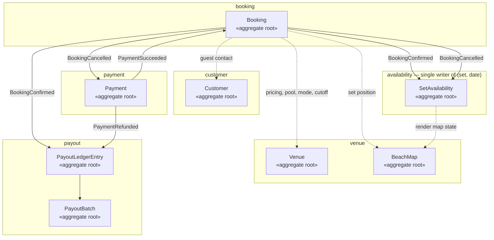

**The spine** (invariant #2, #9): `PaymentSucceeded → BookingConfirmed →`
availability marks the set taken **and** payout accrues a ledger entry. On
`BookingCancelled →` availability frees the set **and** payment refunds per policy.

---

## 2. Actors & use cases

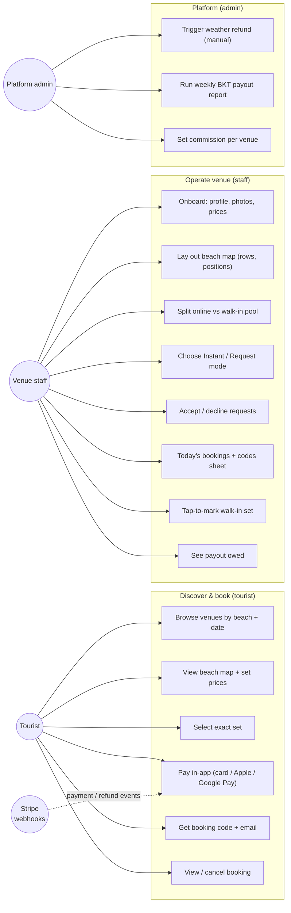

> v1 scope note: weather refund and payout reporting are **manual/admin** (invariant
> #10, spec §6 & §10). No same-day booking — bookings close the evening before
> (invariant #4).

---

## 3. Aggregates, entities & value objects

One class diagram per bounded context. `«aggregate root»` = transactional
consistency boundary. Cross-aggregate links are **by technical id only** (invariant
#11) — never object references across a boundary. Money is always integer minor
units + currency (invariant #5).

### 3.1 `venue`

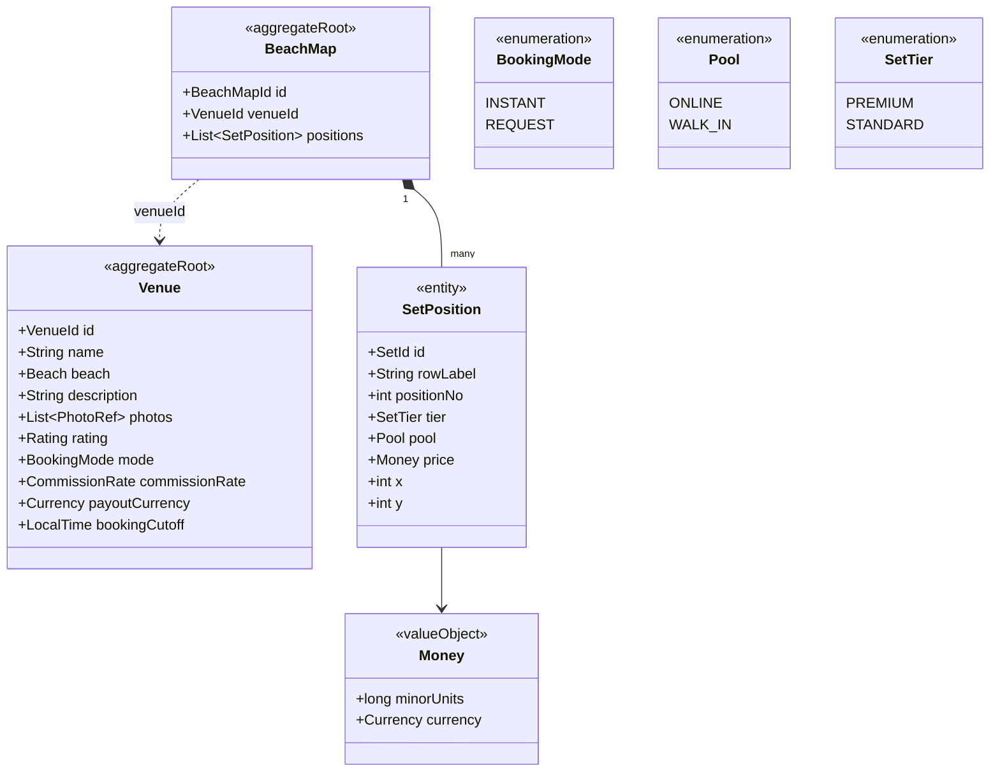

> `bookingCutoff` defaults to 18:00 `Europe/Tirane` (invariant #4, #6). `pool`
> keeps online and walk-in sets physically separate (invariant #3) — an online
> booking can only target an `ONLINE` set.

### 3.2 `availability` — the heart (invariant #2)

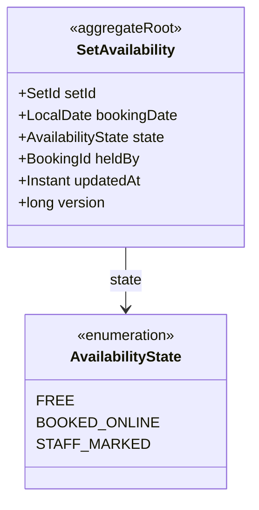

> Identity is the pair **(setId, bookingDate)**. A DB `UNIQUE(set_id, booking_date)`
> constraint plus a claim done as `SELECT ... FOR UPDATE` or
> `INSERT ... ON CONFLICT DO NOTHING` guarantees **at most one party per set per
> date** (invariant #2). This module is the *only* writer of this table — both
> online bookings and staff taps go through it.

### 3.3 `booking`

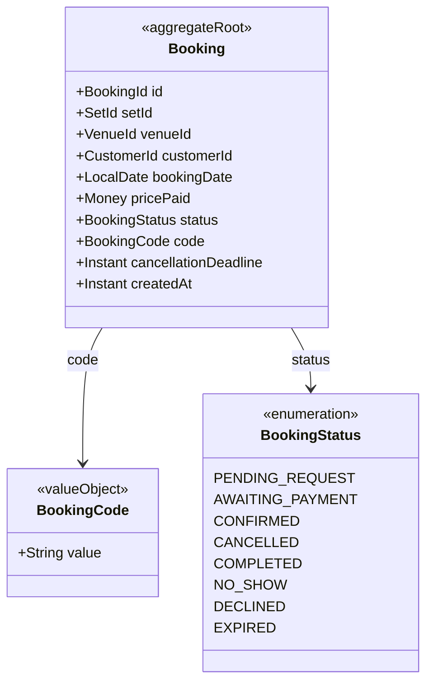

> `BookingCode` is an unguessable bearer credential — ≥ 8 random base32 chars,
> never sequential, treated as a secret in logs (invariant #7). `cancellationDeadline`
> is the evening-before cutoff, computed in `Europe/Tirane`, stored UTC (invariant #4, #6).

### 3.4 `payment`

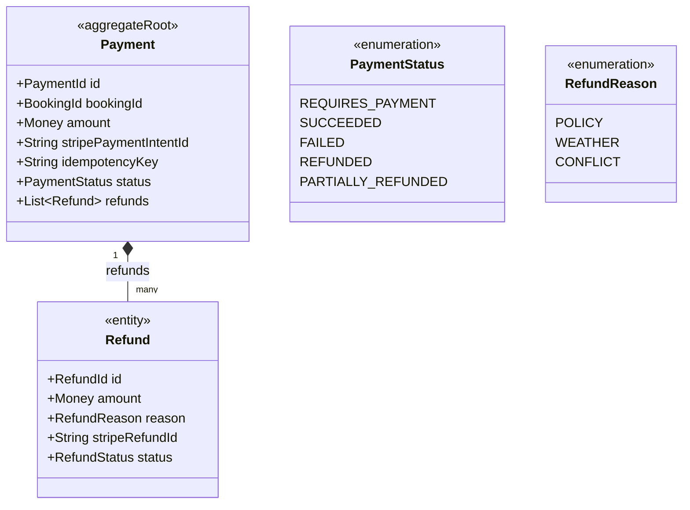

> State is reconciled from **signature-verified Stripe webhooks**, never the client
> redirect (invariant #8). Charge/refund creation uses **idempotency keys**.
> Collection-only — no Stripe Connect (see `riviera-stripe-payments`).

### 3.5 `payout`

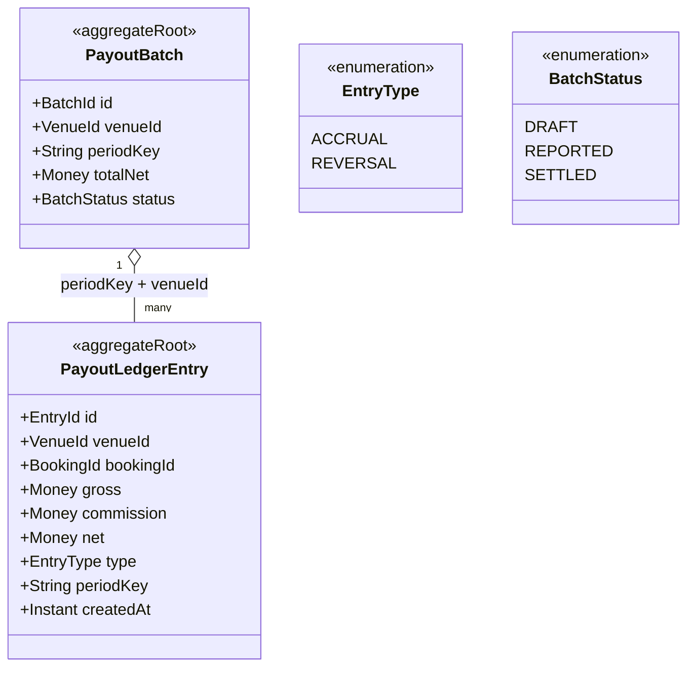

> A booking contributes **exactly once** (an `ACCRUAL`); a refund posts a `REVERSAL`
> (invariant #9). `net = gross − commission`; commission rate stored per venue.
> Payouts settle manually via BKT — the ledger is the record of what is owed.

### 3.6 `customer`

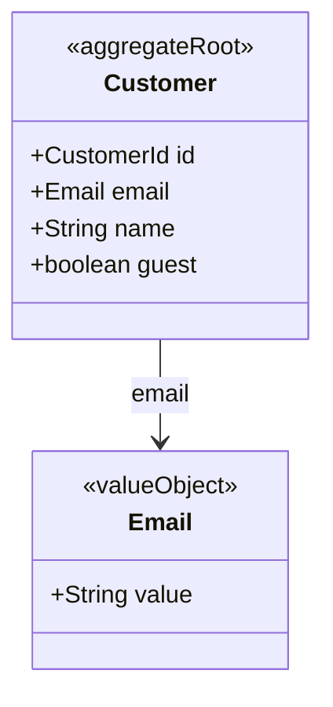

> Intentionally light — guest checkout with an email is acceptable (spec §4.1).

---

## 4. Core flow — Instant Book (happy path)

Shows the double-booking claim (invariant #2) and webhook-as-source-of-truth
(invariant #8) working together.

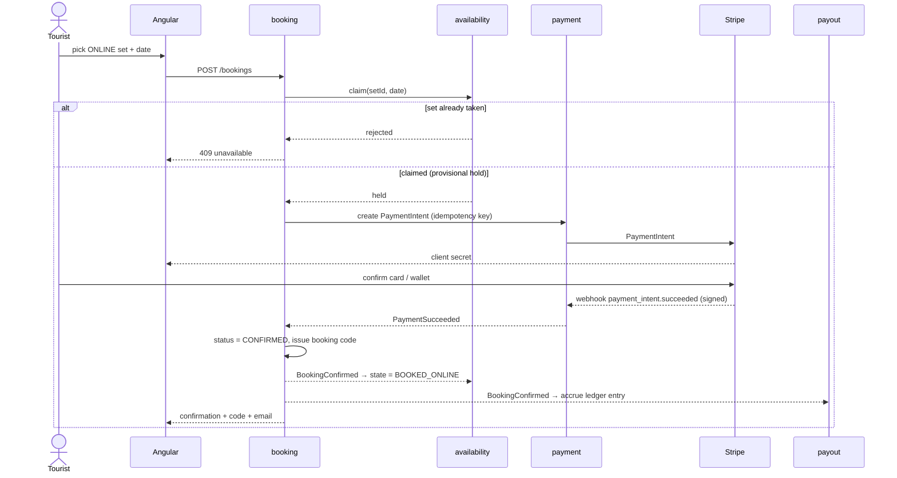

---

## 5. Core flow — cancellation & refund

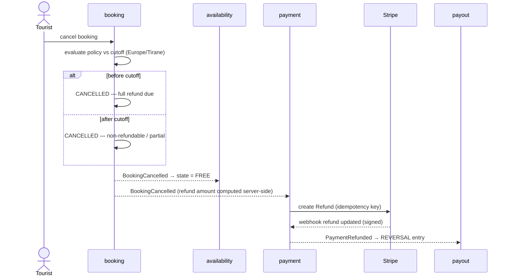

> Refund amounts are computed **server-side** then actioned via Stripe (invariant
> #10). Weather refunds are the same flow but admin-triggered with reason `WEATHER`.

---

## 6. State machines

### 6.1 Booking lifecycle

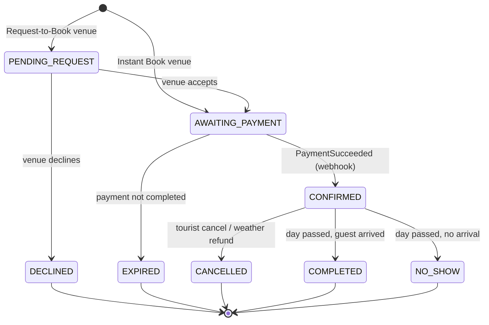

### 6.2 Set availability per (set, date)

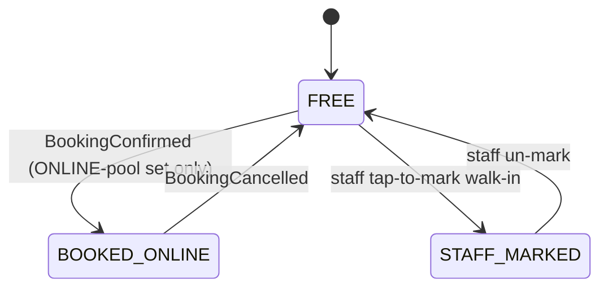

---

## How to extend this

- Edit the Mermaid blocks above; GitHub re-renders on push. For a quick local
  preview use the [Mermaid Live Editor](https://mermaid.live/).
- When names/fields change at scaffolding, update here first — this doc is the
  shared picture the modules are built against.
