# Riviera Sunbed Booking — Domain Model (diagrams)

> **As-built** domain model. This file visualizes the modules, the tables and Java types they
> own, actors & use cases, and the core flows. It is derived from
> `docs/superpowers/specs/2026-06-25-riviera-sunbed-booking-design.md` and the
> invariants in `/CLAUDE.md` (referenced below as "invariant #N").
>
> **Vocabulary (ADR-0018).** The platform is **one bounded context** with twelve modules, and it
> has no aggregate-root classes: `domain/` holds policies, calculations and value objects, and the
> lifecycles live in guarded SQL. The diagrams below say what a thing *is* — a table row, a record,
> an enum, a rule — rather than labelling it an aggregate.
>
> Both booking modes are built end-to-end: Instant Book (signature-verified webhooks, the
> event spine through the Modulith Event Publication Registry, the payout ledger, per-venue
> authorization) and Request-to-Book (soft-hold on the shared availability claim, operator
> accept/decline with payment-request-on-accept, the request-expiry sweep). Where a diagram
> and the code disagree, the code and `RESPONSIBILITIES.md` win.
>
> All diagrams are [Mermaid](https://mermaid.js.org/) and render on GitHub.

---

## 1. Module map

The **nine domain modules** and how they collaborate. Each node is named for the state its module
owns. **Solid arrows = domain events** (state changes). **Dotted arrows = `api/` port queries**
(reads). Modules never import each other's internals — only `api/` ports or events (invariant #11).

The other **three of the twelve** modules are not drawn because they collaborate with nobody:
`shared` (the OPEN kernel of edge types) and the two closed ADR-0017 mechanisms, `challenge`
(proof of work, owns `challenge_registry`) and `audit` (the admin audit trail, owns
`admin_audit_record`). Both are reached from the platform edge through a port; no domain module
knows either exists.

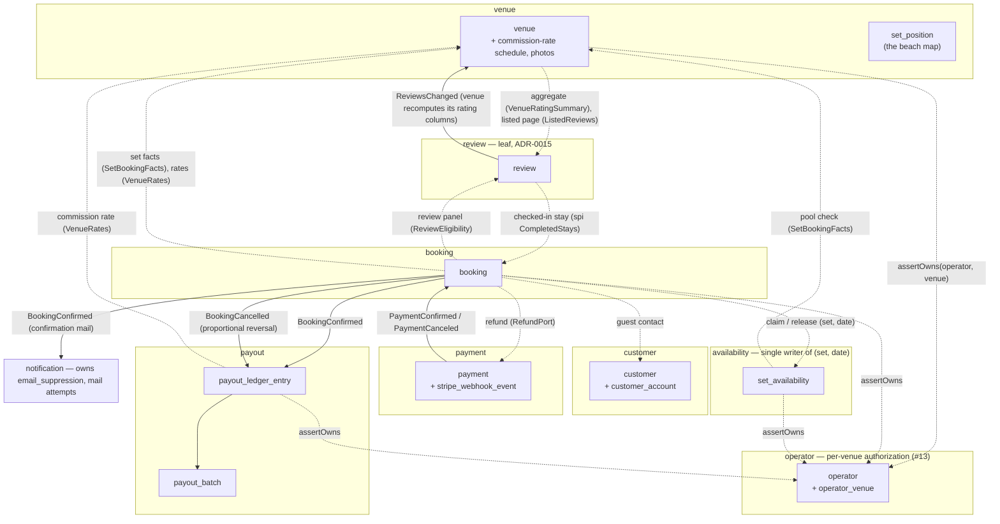
```mermaid
graph TB
    subgraph customer["customer"]
        CUST["customer<br/>+ customer_account"]
    end
    subgraph venue["venue"]
        VEN["venue<br/>+ commission-rate schedule, photos"]
        MAP["set_position<br/>(the beach map)"]
    end
    subgraph availability["availability — single writer of (set, date)"]
        AVAIL["set_availability"]
    end
    subgraph booking["booking"]
        BOOK["booking"]
    end
    subgraph payment["payment"]
        PAY["payment<br/>+ stripe_webhook_event"]
    end
    subgraph payout["payout"]
        LEDG["payout_ledger_entry"]
        BATCH["payout_batch"]
    end
    subgraph notification["notification — owns email_suppression, mail attempts"]
    end

    subgraph operator["operator — per-venue authorization (#13)"]
        OP["operator<br/>+ operator_venue"]
    end
    subgraph review["review — leaf, ADR-0015"]
        REV["review"]
    end

    PAY -- "PaymentConfirmed / PaymentCanceled" --> BOOK
    BOOK -- "BookingConfirmed" --> LEDG
    BOOK -- "BookingConfirmed (confirmation mail)" --> notification
    BOOK -- "BookingCancelled (proportional reversal)" --> LEDG
    REV -- "ReviewsChanged (venue recomputes its rating columns)" --> VEN
    VEN -. "aggregate (VenueRatingSummary), listed page (ListedReviews)" .-> REV
    BOOK -. "review panel (ReviewEligibility)" .-> REV
    REV -. "checked-in stay (spi CompletedStays)" .-> BOOK

    BOOK -. "claim / release (set, date)" .-> AVAIL
    BOOK -. "refund (RefundPort)" .-> PAY
    BOOK -. "set facts (SetBookingFacts), rates (VenueRates)" .-> VEN
    BOOK -. "guest contact" .-> CUST
    AVAIL -. "pool check (SetBookingFacts)" .-> VEN
    LEDG -. "commission rate (VenueRates)" .-> VEN
    VEN -. "assertOwns(operator, venue)" .-> OP
    BOOK -. "assertOwns" .-> OP
    AVAIL -. "assertOwns" .-> OP
    LEDG -. "assertOwns" .-> OP
    LEDG --> BATCH
```

**The spine** (invariants #2, #8, #9): the `(set, date)` claim is taken
**synchronously at reserve time**, before any money moves (invariant #2 lives in the
claim, not an event). The verified webhook drives `PaymentConfirmed → booking
CONFIRMED → BookingConfirmed → payout` accrues. On cancellation, `booking` releases
the claim via the availability port, and `BookingCancelled` drives both the refund
(executed through `payment`'s `RefundPort`) and the proportional ledger `REVERSAL`.

### 1.1 What is not in a module: the platform edge

A substantial part of the system sits in the composition root (`ai.riviera.platform`), not in any
module, and no diagram here shows it — so it is stated instead. The root holds the login machinery
and the fences: `SecurityConfig` and the filter chain (`RateLimitFilter`,
`ChallengeVerificationFilter`, `AdminAuditFilter`, `CorrelationIdFilter`), the session principals
and their revocation, the SSO gateways, the error contract (`ApiErrorHandler`, `ApiProblem`), and
**nine controllers** — auth, SSO, my-account, account recovery, my-erasure, admin-operator,
admin-erasure, operator-account, and the profile-guarded mock SSO IdP.

Two consequences a reader of §1 would otherwise miss: `customer` and `operator` have **no
controllers of their own** — everything a person does with an account is an edge endpoint calling
their ports — and the rule that keeps this honest runs one way only. Modules depend on `shared`,
the root depends on modules, and **nothing depends on the root** (ADR-0007 Amendment 2, machine-checked
by `CompositionRootDisciplineTests`). `RESPONSIBILITIES.md` § *Platform edge* is the contract.

---

## 2. Actors & use cases

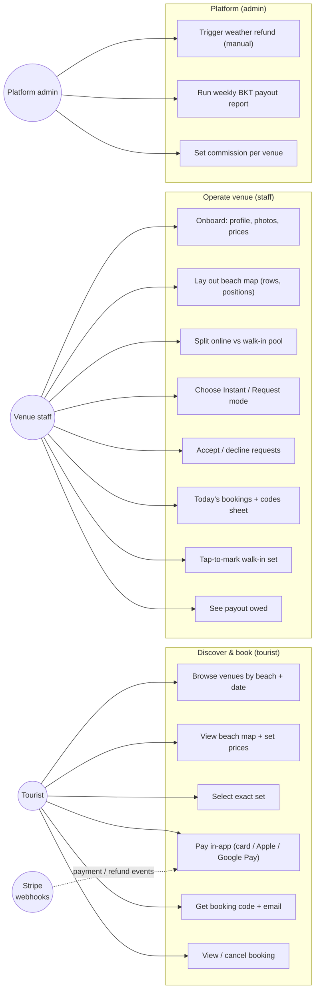
```mermaid
graph LR
    Tourist(("Tourist"))
    Staff(("Venue staff"))
    Admin(("Platform admin"))
    Stripe(("Stripe<br/>webhooks"))

    subgraph discover["Discover & book (tourist)"]
        U1["Browse venues by beach + date"]
        U2["View beach map + set prices"]
        U3["Select exact set"]
        U4["Pay in-app (card / Apple / Google Pay)"]
        U5["Get booking code + email"]
        U6["View / cancel booking"]
    end

    subgraph operate["Operate venue (staff)"]
        V1["Onboard: profile, photos, prices"]
        V2["Lay out beach map (rows, positions)"]
        V3["Split online vs walk-in pool"]
        V4["Choose Instant / Request mode"]
        V5["Accept / decline requests"]
        V6["Today's bookings + codes sheet"]
        V7["Tap-to-mark walk-in set"]
        V8["See payout owed"]
    end

    subgraph platform["Platform (admin)"]
        A1["Trigger weather refund (manual)"]
        A2["Run weekly BKT payout report"]
        A3["Set commission per venue"]
    end

    Tourist --> U1 & U2 & U3 & U4 & U5 & U6
    Staff --> V1 & V2 & V3 & V4 & V5 & V6 & V7 & V8
    Admin --> A1 & A2 & A3
    Stripe -. "payment / refund events" .-> U4
```

> v1 scope note: weather refund and payout reporting are **manual/admin** (invariant
> #10). A date sells until the venue's own sales close on the day itself (invariant #4);
> the evening-before cutoff governs free cancellation only.

---

## 3. Tables, records and rules

One diagram per domain module — all nine. What each stereotype means:

- `<<table>>` — a row shape, with the column names the schema actually uses. The table is where
  the state and, for `booking` and `operator`, the lifecycle live; there is no class holding
  either (ADR-0018 §6).
- `<<record>>` / `<<enum>>` — a Java type that exists, at the path given. Published ids and value
  records sit in the module's `vocabulary/`; pure rules, calculations and enums in `domain/`.
- `<<rule>>` — a policy or calculation class in `domain/` (ADR-0018 §1).

Columns are the load-bearing ones, not every column. Cross-module links are **by technical id
only** (invariant #11). Money is integer minor units + an ISO currency, as a `_minor`/`_currency`
column pair or a value record (invariant #5).

### 3.1 `venue`

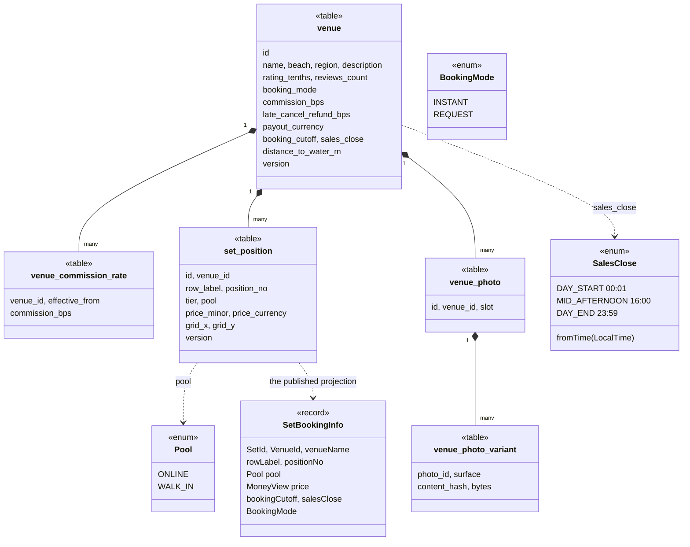
```mermaid
classDiagram
    class venue {
        <<table>>
        id
        name, beach, region, description
        rating_tenths, reviews_count
        booking_mode
        commission_bps
        late_cancel_refund_bps
        payout_currency
        booking_cutoff, sales_close
        distance_to_water_m
        version
    }
    class venue_commission_rate {
        <<table>>
        venue_id, effective_from
        commission_bps
    }
    class set_position {
        <<table>>
        id, venue_id
        row_label, position_no
        tier, pool
        price_minor, price_currency
        grid_x, grid_y
        version
    }
    class venue_photo {
        <<table>>
        id, venue_id, slot
    }
    class venue_photo_variant {
        <<table>>
        photo_id, surface
        content_hash, bytes
    }
    class SalesClose {
        <<enum>>
        DAY_START 00:01
        MID_AFTERNOON 16:00
        DAY_END 23:59
        fromTime(LocalTime)
    }
    class SetBookingInfo {
        <<record>>
        SetId, VenueId, venueName
        rowLabel, positionNo
        Pool pool
        MoneyView price
        bookingCutoff, salesClose
        BookingMode
    }
    class Pool {
        <<enum>>
        ONLINE
        WALK_IN
    }
    class BookingMode {
        <<enum>>
        INSTANT
        REQUEST
    }
    venue "1" *-- "many" set_position
    venue "1" *-- "many" venue_commission_rate
    venue "1" *-- "many" venue_photo
    venue_photo "1" *-- "many" venue_photo_variant
    venue ..> SalesClose : sales_close
    set_position ..> Pool : pool
    set_position ..> SetBookingInfo : the published projection
```

> There is no `Venue`, `BeachMap` or `CommissionRate` class: the beach map **is** the
> `set_position` rows for a venue, and the live commission rate is `venue.commission_bps` with the
> **effective-dated schedule** in `venue_commission_rate` — history is never repriced, so a single
> field could not represent it. Photos are two tables (`venue_photo` + `venue_photo_variant`,
> ADR-0008) addressed by `PhotoSlot`/`PhotoSurface`/`ContentHash`, not a `PhotoRef`. `venue`'s whole
> `domain/` package is `SalesClose`, the three-valued sales-close choice (invariant #4); prices are
> `price_minor` + `price_currency`, projected onto the wire as `MoneyView`.
>
> `booking_cutoff` (the free-cancellation cutoff) defaults to 18:00 and `sales_close` to 16:00, both
> `Europe/Tirane` (invariants #4, #6). `pool` keeps online and walk-in sets physically separate
> (invariant #3) — an online booking can only target an `ONLINE` set.

### 3.2 `availability` — the heart (invariant #2)

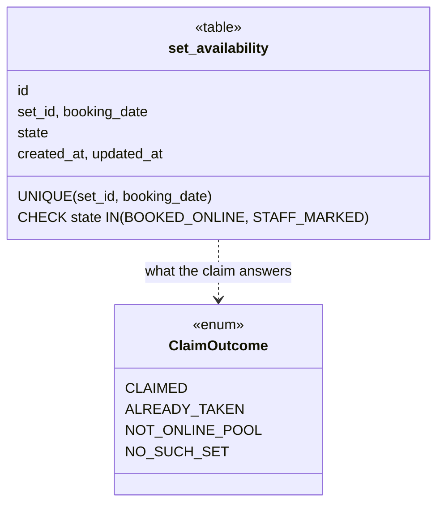
```mermaid
classDiagram
    class set_availability {
        <<table>>
        id
        set_id, booking_date
        state
        created_at, updated_at
        UNIQUE (set_id, booking_date)
        CHECK state IN (BOOKED_ONLINE, STAFF_MARKED)
    }
    class ClaimOutcome {
        <<enum>>
        CLAIMED
        ALREADY_TAKEN
        NOT_ONLINE_POOL
        NO_SUCH_SET
    }
    set_availability ..> ClaimOutcome : what the claim answers
```

> Identity is the pair **(set_id, booking_date)**, and `set_availability_uniq UNIQUE (set_id,
> booking_date)` plus an atomic `INSERT … ON CONFLICT DO NOTHING` (`JdbcAvailabilityClaim`)
> guarantees **at most one party per set per date** (invariant #2), chosen over
> `SELECT … FOR UPDATE`. This module is the *only* writer of the table — online bookings and staff
> taps alike go through it, machine-checked by a bytecode scan.
>
> **There is no `FREE` token and no holder.** FREE is the *absence* of a row, which is why the
> CHECK admits only two states; the row records **that** a set is held, never **why** or by whom.
> The discriminator lives on `booking.status` instead, and every release is a guarded status
> transition in the same transaction (§6.2). `availability` has **no `domain/` package** and should
> not have one: a Java class asserting the uniqueness rule would be a weaker restatement of the
> constraint (ADR-0018 §3).

### 3.3 `booking`

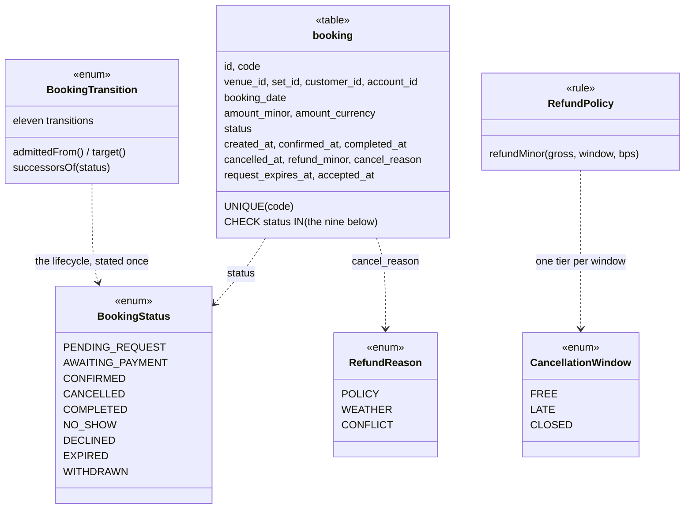
```mermaid
classDiagram
    class booking {
        <<table>>
        id, code
        venue_id, set_id, customer_id, account_id
        booking_date
        amount_minor, amount_currency
        status
        created_at, confirmed_at, completed_at
        cancelled_at, refund_minor, cancel_reason
        request_expires_at, accepted_at
        UNIQUE (code)
        CHECK status IN (the nine below)
    }
    class BookingStatus {
        <<enum>>
        PENDING_REQUEST
        AWAITING_PAYMENT
        CONFIRMED
        CANCELLED
        COMPLETED
        NO_SHOW
        DECLINED
        EXPIRED
        WITHDRAWN
    }
    class BookingTransition {
        <<enum>>
        eleven transitions
        admittedFrom() / target()
        successorsOf(status)
    }
    class RefundPolicy {
        <<rule>>
        refundMinor(gross, window, bps)
    }
    class CancellationWindow {
        <<enum>>
        FREE
        LATE
        CLOSED
    }
    class RefundReason {
        <<enum>>
        POLICY
        WEATHER
        CONFLICT
    }
    booking ..> BookingStatus : status
    BookingTransition ..> BookingStatus : the lifecycle, stated once
    RefundPolicy ..> CancellationWindow : one tier per window
    booking ..> RefundReason : cancel_reason
```

> The booking **code** is an unguessable bearer credential — ≥ 8 random base32 chars, never
> sequential, a secret in logs (invariant #7), stored as a plain `code` column under
> `booking_code_uniq`. There is **no stored cancellation deadline**: it is computed per request by
> `CancellationPolicy` from the venue's `booking_cutoff` in `Europe/Tirane` (invariants #4, #6), so
> a reader looking for the column will not find one. The amount is the `amount_minor` +
> `amount_currency` pair.
>
> **The lifecycle is enforced in SQL**, as ten guarded `UPDATE … WHERE status = … RETURNING`
> statements in `JdbcBookings` plus `booking_status_check` — eleven transitions, because the one
> cancel statement is driven twice with different admitted statuses (the guest's and the admin
> weather refund's). `BookingTransition` states the same table in Java, and
> `JdbcBookingTransitionTableIT` holds the two together. `EXPIRED` is a request the venue never
> answered (deadline sweep); an abandoned `AWAITING_PAYMENT` booking — instant, or an
> accepted-but-unpaid request past its pay window — is swept to `CANCELLED`. §6.1 draws it.
>
> **Scale note.** `booking` is by a wide margin the largest module, and the only one ADR-0007
> (sub-decision 3) slices by use case: `application/{reserve, cancel, refund, request, checkin,
> view}`, with `domain/` flat and shared. A nine-field sketch is not the shape of the module; the
> slices are.

### 3.4 `payment`

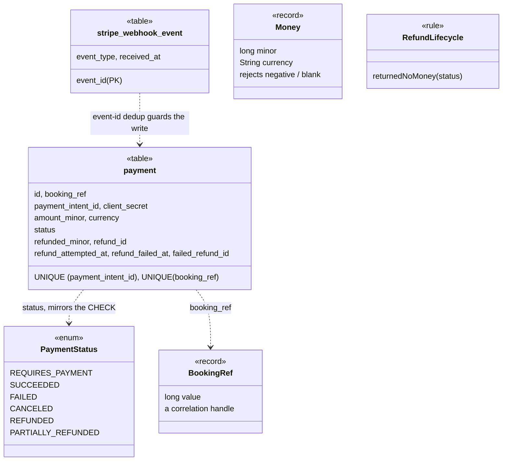
```mermaid
classDiagram
    class payment {
        <<table>>
        id, booking_ref
        payment_intent_id, client_secret
        amount_minor, currency
        status
        refunded_minor, refund_id
        refund_attempted_at, refund_failed_at, failed_refund_id
        UNIQUE (payment_intent_id), UNIQUE (booking_ref)
    }
    class stripe_webhook_event {
        <<table>>
        event_id (PK)
        event_type, received_at
    }
    class PaymentStatus {
        <<enum>>
        REQUIRES_PAYMENT
        SUCCEEDED
        FAILED
        CANCELED
        REFUNDED
        PARTIALLY_REFUNDED
    }
    class Money {
        <<record>>
        long minor
        String currency
        rejects negative / blank
    }
    class BookingRef {
        <<record>>
        long value
        a correlation handle
    }
    class RefundLifecycle {
        <<rule>>
        returnedNoMoney(status)
    }
    payment ..> PaymentStatus : status, mirrors the CHECK
    payment ..> BookingRef : booking_ref
    stripe_webhook_event ..> payment : event-id dedup guards the write
```

> **At most one refund per payment, and no `Refund` entity.** V11 added two columns —
> `refunded_minor` and `refund_id` — not a table, so the model is one refund per payment rather
> than a collection; V42 added the failure trace behind the resubmission lever (§5). There is no
> `PaymentId`, `RefundId` or `RefundStatus` type, and the **idempotency key is not stored** at all:
> it is derived from the booking id at call time. `RefundReason` belongs to `booking` — why a
> refund happened is `booking`'s word, not the gateway's.
>
> State is reconciled from **signature-verified Stripe webhooks**, never the client redirect
> (invariant #8), with `stripe_webhook_event`'s event-id primary key as the replay guard.
> Collection-only — no Stripe Connect (see `riviera-stripe-payments`).

### 3.5 `payout`

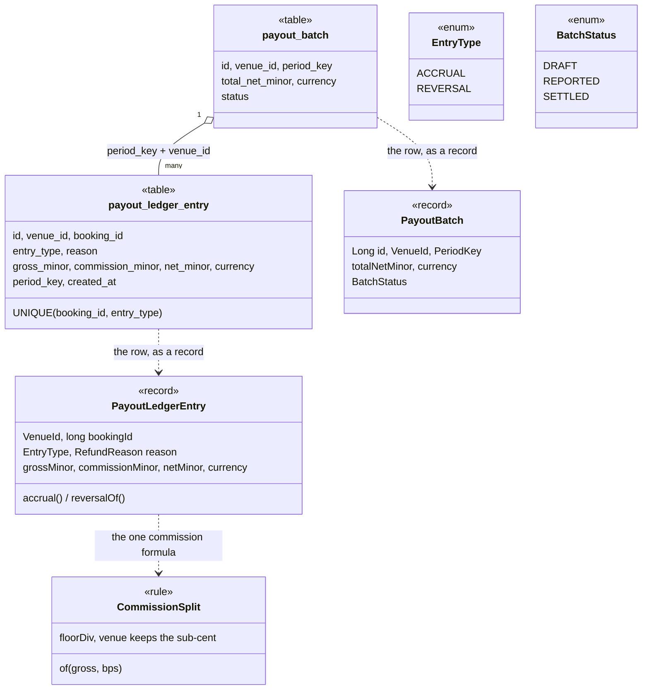
```mermaid
classDiagram
    class payout_ledger_entry {
        <<table>>
        id, venue_id, booking_id
        entry_type, reason
        gross_minor, commission_minor, net_minor, currency
        period_key, created_at
        UNIQUE (booking_id, entry_type)
    }
    class payout_batch {
        <<table>>
        id, venue_id, period_key
        total_net_minor, currency
        status
    }
    class PayoutLedgerEntry {
        <<record>>
        VenueId, long bookingId
        EntryType, RefundReason reason
        grossMinor, commissionMinor, netMinor, currency
        accrual() / reversalOf()
    }
    class PayoutBatch {
        <<record>>
        Long id, VenueId, PeriodKey
        totalNetMinor, currency
        BatchStatus
    }
    class CommissionSplit {
        <<rule>>
        of(gross, bps)
        floorDiv, venue keeps the sub-cent
    }
    class EntryType {
        <<enum>>
        ACCRUAL
        REVERSAL
    }
    class BatchStatus {
        <<enum>>
        DRAFT
        REPORTED
        SETTLED
    }
    payout_ledger_entry ..> PayoutLedgerEntry : the row, as a record
    payout_batch ..> PayoutBatch : the row, as a record
    PayoutLedgerEntry ..> CommissionSplit : the one commission formula
    payout_batch "1" o-- "many" payout_ledger_entry : period_key + venue_id
```

> These two records are the only ones the docs ever called aggregate roots that actually exist —
> and they are **immutable value records**, not mutable roots with identity and a lifecycle
> (ADR-0018 §6): the entry carries the `accrual`/`reversalOf` factories, while the batch is built
> straight through its canonical constructor. The entry carries no id type, no
> `Money`, and one field the old diagram omitted: `reason`, which is what makes a `REVERSAL`
> auditable under invariant #9. `bookingId` is a bare `long` while `venueId` is typed.
>
> A booking contributes **exactly once** (an `ACCRUAL`) and a refund posts a proportional
> `REVERSAL`, enforced by `payout_once_per_booking UNIQUE (booking_id, entry_type)` (invariant #9).
> `net = gross − commission`, checked in the record's canonical constructor and again by
> `payout_net_check`; the rate is per venue and effective-dated (§3.1). Payouts settle manually via
> BKT — the ledger is the record of what is owed.

### 3.6 `customer`

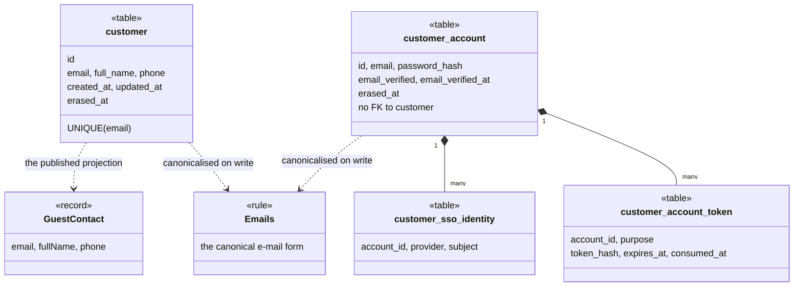
```mermaid
classDiagram
    class customer {
        <<table>>
        id
        email, full_name, phone
        created_at, updated_at
        erased_at
        UNIQUE (email)
    }
    class customer_account {
        <<table>>
        id, email, password_hash
        email_verified, email_verified_at
        erased_at
        no FK to customer
    }
    class customer_sso_identity {
        <<table>>
        account_id, provider, subject
    }
    class customer_account_token {
        <<table>>
        account_id, purpose
        token_hash, expires_at, consumed_at
    }
    class GuestContact {
        <<record>>
        email, fullName, phone
    }
    class Emails {
        <<rule>>
        the canonical e-mail form
    }
    customer ..> GuestContact : the published projection
    customer_account "1" *-- "many" customer_sso_identity
    customer_account "1" *-- "many" customer_account_token
    customer ..> Emails : canonicalised on write
    customer_account ..> Emails : canonicalised on write
```

> **There is no `guest` flag and no `Email` value type.** Guest-ness is not a field: it is which
> of two deliberately unlinked tables the row is in — `customer` is the contact a booking is made
> with, `customer_account` is a sign-in identity, and the two are never joined
> (`RESPONSIBILITIES.md` §`customer`). Two id types match them, `CustomerId` and
> `CustomerAccountId`; `Emails` is a canonicalisation helper, not a wrapper type. The module has
> **no `domain/` package**: its one policy value, the retention window, is a plain record in
> `application/`, and the retention question itself ("does a contact still have a booking on or
> after the cutoff?") is a SQL predicate reached through a port.
>
> Erasure is pseudonymise-in-place (ADR-0010): `erased_at` is stamped and the contact scrubbed —
> rows are tombstoned, never deleted, and reviews are scrubbed inside the same transaction.

### 3.7 `operator` — the per-venue authorization fence (#13)

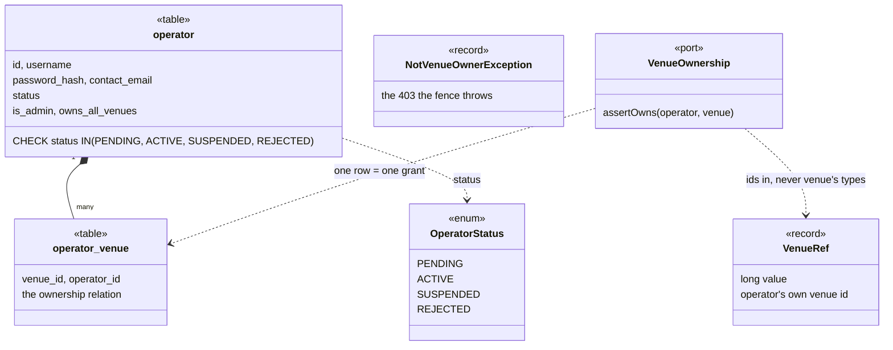
```mermaid
classDiagram
    class operator {
        <<table>>
        id, username
        password_hash, contact_email
        status
        is_admin, owns_all_venues
        CHECK status IN (PENDING, ACTIVE, SUSPENDED, REJECTED)
    }
    class operator_venue {
        <<table>>
        venue_id, operator_id
        the ownership relation
    }
    class OperatorStatus {
        <<enum>>
        PENDING
        ACTIVE
        SUSPENDED
        REJECTED
    }
    class VenueRef {
        <<record>>
        long value
        operator's own venue id
    }
    class NotVenueOwnerException {
        <<record>>
        the 403 the fence throws
    }
    class VenueOwnership {
        <<port>>
        assertOwns(operator, venue)
    }
    operator "1" *-- "many" operator_venue
    operator ..> OperatorStatus : status
    VenueOwnership ..> operator_venue : one row = one grant
    VenueOwnership ..> VenueRef : ids in, never venue's types
```

> No `Operator` class and **no `domain/` package**: the account is a row, ownership is a row in
> `operator_venue`, and the status lifecycle is the same guarded `UPDATE … WHERE status =
> :expected` idiom as `booking`'s. `OperatorStatus` is published rather than centralised on
> purpose — each status predicate lives with its owner: the edge's may-authenticate set, the
> module's ownership resolution, and tourist visibility.
>
> The module publishes its own `VenueRef` instead of importing `venue.vocabulary.VenueId`, because
> `venue` calls `assertOwns` and the reverse import would close a Modulith cycle (ADR-0007's
> closing note). Four modules — `venue`, `booking`, `availability`, `payout` — call the one port,
> which is the point: invariant #13 has a single home and no bypass. `/api/admin/**` is role-gated
> and exempt.

### 3.8 `review` — a leaf module (ADR-0015)

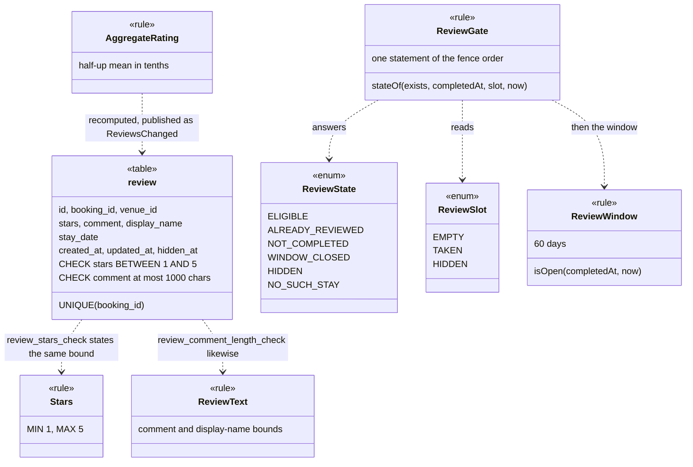
```mermaid
classDiagram
    class review {
        <<table>>
        id, booking_id, venue_id
        stars, comment, display_name
        stay_date
        created_at, updated_at, hidden_at
        UNIQUE (booking_id)
        CHECK stars BETWEEN 1 AND 5
        CHECK comment at most 1000 chars
    }
    class ReviewGate {
        <<rule>>
        stateOf(exists, completedAt, slot, now)
        one statement of the fence order
    }
    class ReviewState {
        <<enum>>
        ELIGIBLE
        ALREADY_REVIEWED
        NOT_COMPLETED
        WINDOW_CLOSED
        HIDDEN
        NO_SUCH_STAY
    }
    class ReviewSlot {
        <<enum>>
        EMPTY
        TAKEN
        HIDDEN
    }
    class ReviewWindow {
        <<rule>>
        isOpen(completedAt, now)
        60 days
    }
    class Stars {
        <<rule>>
        MIN 1, MAX 5
    }
    class ReviewText {
        <<rule>>
        comment and display-name bounds
    }
    class AggregateRating {
        <<rule>>
        half-up mean in tenths
    }
    ReviewGate ..> ReviewState : answers
    ReviewGate ..> ReviewSlot : reads
    ReviewGate ..> ReviewWindow : then the window
    review ..> Stars : review_stars_check states the same bound
    review ..> ReviewText : review_comment_length_check likewise
    AggregateRating ..> review : recomputed, published as ReviewsChanged
```

> There is no `Review` class, and yet this is the **richest `domain/` in the codebase** — seven
> pure types — which is the shape ADR-0018 describes: the rules are objects, the row is a row.
> `ReviewGate` is the benchmark the other modules are read against: one statement of the fence
> order, *called* from two services rather than re-derived, so a stay that trips two fences at once
> is told the same thing whichever surface asks.
>
> One review per booking (`review_once_per_booking`), eligible only for a checked-in stay inside
> the 60-day window. `allowedDependencies = { "shared" }` — everything it needs arrives by
> inversion (`spi.CompletedStays`, implemented by `booking`), which is what makes it a leaf. The
> aggregate rating is `review`'s computation and `venue`'s stored column: recomputed here,
> published as `ReviewsChanged`, written there (async — a star rating may lag a second; a set may
> not be double-sold). Admin takedown stamps `hidden_at`; erasure scrubs the name and keeps the
> star, so a tombstoned review still counts.

### 3.9 `notification` — transactional mail

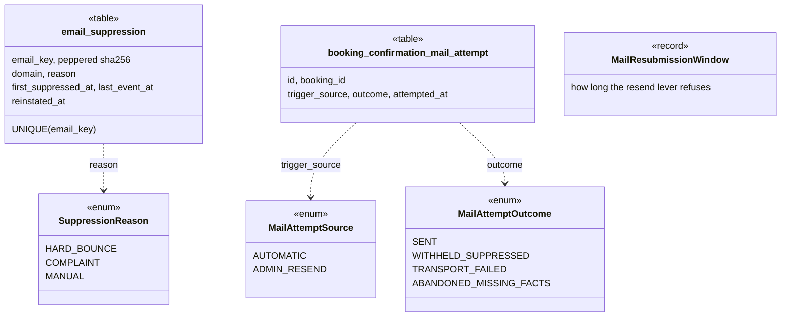
```mermaid
classDiagram
    class email_suppression {
        <<table>>
        email_key, peppered sha256
        domain, reason
        first_suppressed_at, last_event_at
        reinstated_at
        UNIQUE (email_key)
    }
    class booking_confirmation_mail_attempt {
        <<table>>
        id, booking_id
        trigger_source, outcome, attempted_at
    }
    class SuppressionReason {
        <<enum>>
        HARD_BOUNCE
        COMPLAINT
        MANUAL
    }
    class MailAttemptSource {
        <<enum>>
        AUTOMATIC
        ADMIN_RESEND
    }
    class MailAttemptOutcome {
        <<enum>>
        SENT
        WITHHELD_SUPPRESSED
        TRANSPORT_FAILED
        ABANDONED_MISSING_FACTS
    }
    class MailResubmissionWindow {
        <<record>>
        how long the resend lever refuses
    }
    email_suppression ..> SuppressionReason : reason
    booking_confirmation_mail_attempt ..> MailAttemptSource : trigger_source
    booking_confirmation_mail_attempt ..> MailAttemptOutcome : outcome
```

> **No aggregate and no `domain/` package, correctly**: this module's subject is transport,
> suppression and retry, not a domain concept. It owns two tables and holds no address in clear —
> the suppression list is keyed by a peppered SHA-256 (`v1:<64 hex>`, ADR-0012) with the domain
> kept in clear for operational reads.
>
> It listens rather than being called: `BookingConfirmed`, `BookingCancelled`,
> `BookingPaymentDue`, `BookingRequestDeclined` and `BookingRequestExpired` arrive as events — five
> listeners — and the facts each mail needs are resolved back through `booking`/`venue`/`customer`
> ports from inside the listener. Which of the two ADR-0011 vehicles carries a mail follows from
> its payload: an ids-only payload rides the **Event Publication Registry** (at-least-once,
> republished on restart), while a payload carrying a bearer credential — a verification or
> password-reset token — rides a **bounded in-memory executor** instead, because the registry would
> persist that token in cleartext (invariant #7). Every attempt is logged with its source and
> outcome, so an admin can see what happened and re-send; that re-send is synchronous, and reports
> the real outcome. Both vehicles sit behind one `Mailer` port, with the mock profile-guarded out
> of production.

---

## 4. Core flow — Instant Book (happy path)

Shows the double-booking claim (invariant #2) and webhook-as-source-of-truth
(invariant #8) working together.

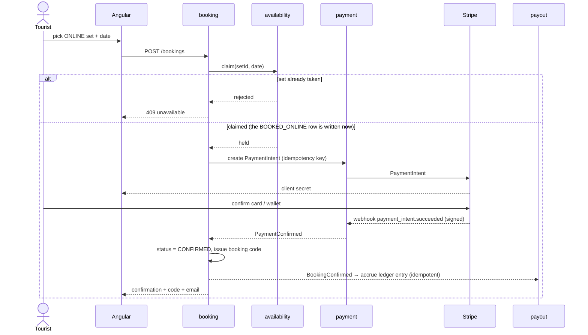
```mermaid
sequenceDiagram
    actor T as Tourist
    participant FE as Angular
    participant B as booking
    participant A as availability
    participant P as payment
    participant S as Stripe
    participant L as payout

    T->>FE: pick ONLINE set + date
    FE->>B: POST /bookings
    B->>A: claim(setId, date)
    alt set already taken
        A-->>B: rejected
        B-->>FE: 409 unavailable
    else claimed (the BOOKED_ONLINE row is written now)
        A-->>B: held
        B->>P: create PaymentIntent (idempotency key)
        P->>S: PaymentIntent
        S-->>FE: client secret
        T->>S: confirm card / wallet
        S-->>P: webhook payment_intent.succeeded (signed)
        P-->>B: PaymentConfirmed
        B->>B: status = CONFIRMED, issue booking code
        B-->>L: BookingConfirmed → accrue ledger entry (idempotent)
        B-->>FE: confirmation + code + email
    end
```

> As built: the claim is synchronous at reserve time and the row
> is written as `BOOKED_ONLINE` immediately — the reserve transaction **commits before
> the Stripe call**, so no row lock spans the network round-trip. `PaymentConfirmed`
> (webhook-driven) moves the booking to `CONFIRMED`; `PaymentCanceled` moves it to
> `CANCELLED` and releases the claim. Payout accrues on `BookingConfirmed` via the
> Event Publication Registry (at-least-once, idempotent `ON CONFLICT` accrual). An
> abandoned `AWAITING_PAYMENT` booking is swept after a TTL — PaymentIntent cancelled
> first, claim released only on the authoritative `Canceled` outcome.

---

## 5. Core flow — cancellation & refund

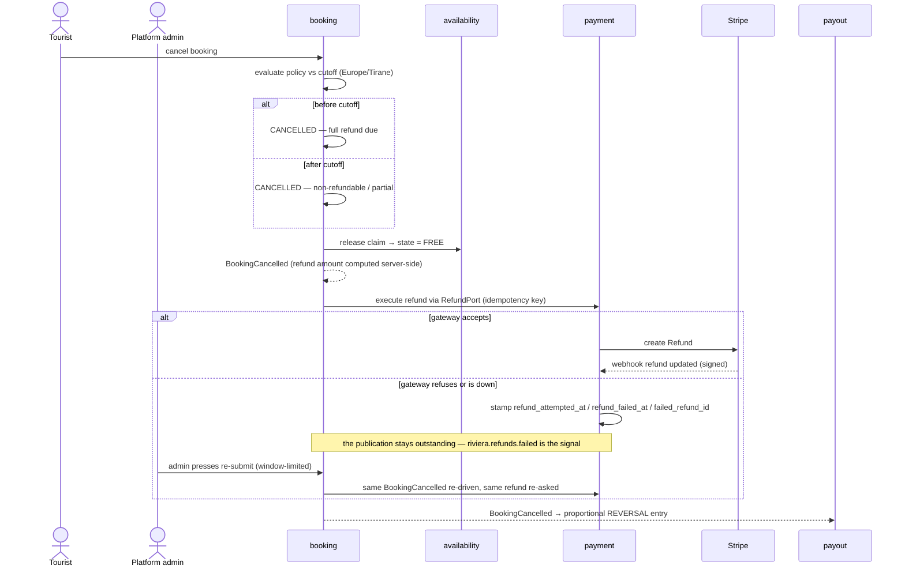
```mermaid
sequenceDiagram
    actor T as Tourist
    actor Adm as Platform admin
    participant B as booking
    participant A as availability
    participant P as payment
    participant S as Stripe
    participant L as payout

    T->>B: cancel booking
    B->>B: evaluate policy vs cutoff (Europe/Tirane)
    alt before cutoff
        B->>B: CANCELLED — full refund due
    else after cutoff
        B->>B: CANCELLED — non-refundable / partial
    end
    B->>A: release claim → state = FREE
    B-->>B: BookingCancelled (refund amount computed server-side)
    B->>P: execute refund via RefundPort (idempotency key)
    alt gateway accepts
        P->>S: create Refund
        S-->>P: webhook refund updated (signed)
    else gateway refuses or is down
        P->>P: stamp refund_attempted_at / refund_failed_at / failed_refund_id
        Note over B,P: the publication stays outstanding — riviera.refunds.failed is the signal
        Adm->>B: admin presses re-submit (window-limited)
        B->>P: same BookingCancelled re-driven, same refund re-asked
    end
    B-->>L: BookingCancelled → proportional REVERSAL entry
```

> Refund amounts are computed **server-side** then actioned via Stripe (invariant #10). Weather
> refunds are the same flow but admin-triggered with reason `WEATHER`, and they alone may reach a
> swept `NO_SHOW`.
>
> **The failure leg is not decoration.** A refund the gateway refuses leaves its `BookingCancelled`
> publication outstanding in the Event Publication Registry, with the attempt traced on the payment
> row (V42). `RefundOutbox` exposes exactly that backlog for the one refund listener and the lever
> to re-drive it; `RefundResubmissionWindow` is how long the lever refuses after an accepted press,
> so an outage cannot be re-swept once per click. Re-driving is safe because it re-issues the *same*
> gateway call: a refund that already succeeded is returned, not repeated. It is a retry loop, not a
> delivery guarantee — a refund that fails again stays outstanding, which is why
> `riviera.outbox.pending` and `riviera.refunds.failed` are the signals to watch.

---

## 6. State machines

### 6.1 Booking lifecycle

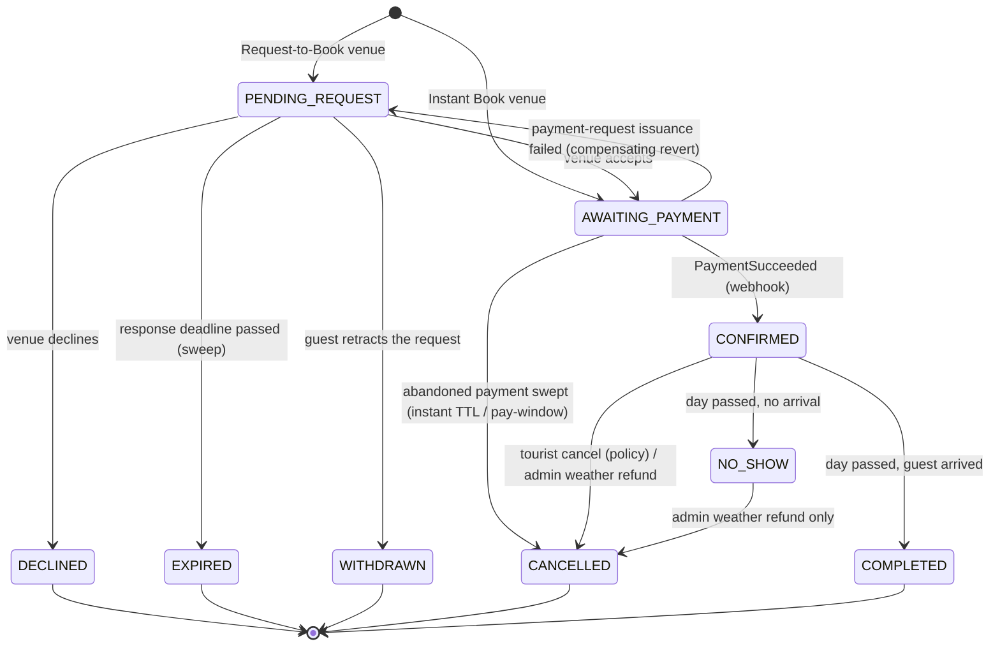
```mermaid
stateDiagram-v2
    [*] --> PENDING_REQUEST: Request-to-Book venue
    [*] --> AWAITING_PAYMENT: Instant Book venue
    PENDING_REQUEST --> AWAITING_PAYMENT: venue accepts
    PENDING_REQUEST --> DECLINED: venue declines
    AWAITING_PAYMENT --> CONFIRMED: PaymentSucceeded (webhook)
    AWAITING_PAYMENT --> CANCELLED: abandoned payment swept (instant TTL / pay-window)
    AWAITING_PAYMENT --> PENDING_REQUEST: payment-request issuance failed (compensating revert)
    PENDING_REQUEST --> EXPIRED: response deadline passed (sweep)
    PENDING_REQUEST --> WITHDRAWN: guest retracts the request
    CONFIRMED --> CANCELLED: tourist cancel (policy) / admin weather refund
    CONFIRMED --> COMPLETED: day passed, guest arrived
    CONFIRMED --> NO_SHOW: day passed, no arrival
    NO_SHOW --> CANCELLED: admin weather refund only
    DECLINED --> [*]
    EXPIRED --> [*]
    WITHDRAWN --> [*]
    CANCELLED --> [*]
    COMPLETED --> [*]
```

> Both entry legs exist. An abandoned payment ends in `CANCELLED` (instant: TTL from
> creation; accepted request: pay-window from `accepted_at`, never past the service day's
> end); `EXPIRED` means the venue never answered before the request deadline (min(request +
> expiry-window, the venue's sales close on the date)), and `WITHDRAWN` means the guest
> retracted the request themselves — one terminal state per party who can end a pending
> request. The soft-hold is the same `BOOKED_ONLINE` availability row as any online booking
> (availability records *that* a set is held, never *why*); all three terminal legs release it.
>
> **`NO_SHOW` is terminal for the guest, not terminal.** The admin weather refund is the one
> transition that reaches it — the sweep gets to a washed-out day before the operator does, so
> those rows are exactly the guests who stayed home because of the storm. The guest's own cancel
> admits `CONFIRMED` and nothing else. Both statements are one table, `BookingTransition`, from
> which the shared cancel statement takes its admitted statuses.

### 6.2 Set availability per (set, date)

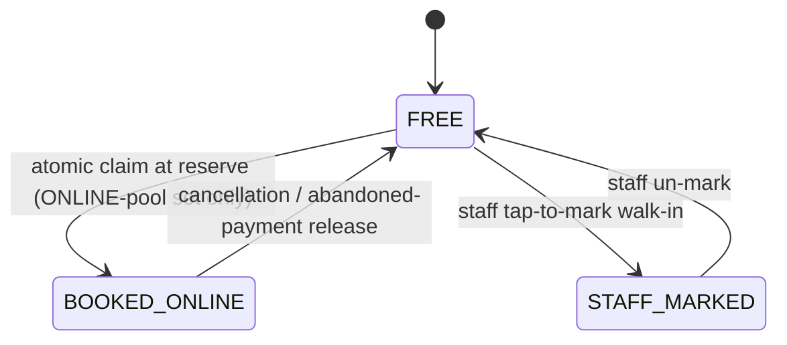
```mermaid
stateDiagram-v2
    [*] --> FREE
    FREE --> BOOKED_ONLINE: atomic claim at reserve (ONLINE-pool set only)
    FREE --> STAFF_MARKED: staff tap-to-mark walk-in
    BOOKED_ONLINE --> FREE: cancellation / abandoned-payment release
    STAFF_MARKED --> FREE: staff un-mark
```

> `FREE` is drawn as a state but stored as the **absence of a row**: the two written states are the
> only tokens the CHECK admits, and every release is a `DELETE` inside the same transaction as the
> guarded booking-status transition that authorised it (§3.2).

---

## How to extend this

- Edit the Mermaid blocks above; GitHub re-renders on push. For a quick local
  preview use the [Mermaid Live Editor](https://mermaid.live/).
- This file follows the code, never the other way round: when a table, type or flow changes, the
  code and `RESPONSIBILITIES.md` are right and this picture is what needs correcting. A diagram
  that shows a class the tree does not have is the failure mode this file has already had once
  (`docs/research/2026-09-04-bounded-context-and-doc-drift-audit.md` §G).
