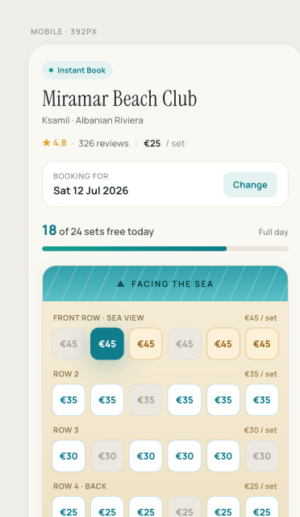

# U1 — Beach-map screen · design reference

Visual reference for **U1 (issue #4): _Venue + beach-map read model; render the visual map_**.
This is a **design intent**, not implementation. The Angular build is done later through the
**`riviera-sdd`** workflow with the **`angular-developer`** skill + **angular-cli MCP** best
practices — treat this folder as the picture of *what* to build, not *how* to code it.

Generated in Claude Design and exported here so the design travels with the issue.

## Preview

- `mobile-preview.png` — authoritative render of the mobile (392px) layout.
- `claude-design-source.dc.html` — full source for **both** the mobile (392px) and desktop
  (1180px) layouts plus the sample data/logic. It is Claude Design's `.dc.html` format
  (`<sc-for>`, `DCLogic`) — a spec to port, **not** drop-in React/Angular code.

## What the screen is

A tourist has opened **one venue for one day** and sees its **visual beach map** read-only,
to understand availability before booking. No booking flow (selection/payment is U3+).

## Layouts

**Mobile (392px), single column, top→bottom:**
1. `Instant Book` mode pill
2. Venue title (display serif) + location
3. Rating · reviews · from-price
4. "Booking for {date}" card + `Change`
5. Availability line ("18 of 24 sets free today") + progress bar
6. **Beach map**: "▲ Facing the sea" banner → sand → 4 rows × 6 sets (row label + per-row
   price on each row) → "Promenade · Entrance ▼" footer
7. Legend (Available / Front row / Taken / Selected)
8. Sticky bottom CTA (title + sub + button), reflects current selection

**Desktop (1180px):** header bar (title + rating left; date card + big from-price right),
then two columns — **left sidebar 340px** (big availability number + progress, "2 loungers +
1 umbrella, full day" note, legend, sticky CTA card) and **right** the beach map with row
labels down the left side.

## Set tile states

| State | Background | Border | Text |
|---|---|---|---|
| Available | `#ffffff` | `#bfe3df` | `#0f7d8c` |
| Front row · premium | `#fbf1d9` | `#e6c483` | `#9c6a16` |
| Taken (not selectable) | `#ece8e0` | dashed `#d2ccbf` | `#aaa399` |
| Selected | `#0f7d8c` | `#0f7d8c` | `#ffffff` |

Hover (non-taken): lift `translateY(-2px)` + teal shadow.

## Design tokens

- **Fonts:** `Manrope` (400–800) for UI/body; `Instrument Serif` (400, italic avail.) for
  display headings. (Both Google Fonts.)
- **Brand teal:** `#0e7a89` (primary), `#15a08f` (accent); progress/CTA gradient `#15a08f → #0e7a89`.
- **Sea:** `#2f9fab → #5cc0c6`. **Sand:** `#f6ecd6 → #efe0c2`. **Page bg:** `#faf8f3`.
- **Premium/gold:** stars `#e2a32b`, border `#e6c483`, fill `#fbf1d9`, row price `#a08850`.
- **Text:** `#22302f` / `#54514b` / `#73706a` / `#94908a`; row labels `#8a7a52`.
- **Surface borders:** `#ece6d8`, `#efe9dd`, `#e8e1d2`.

## Sample data (from the source — for fixtures)

- Venue: **Miramar Beach Club** · Ksamil · Albanian Riviera · ★ 4.8 (326 reviews) · from €25/set
- Date: Sat 12 Jul 2026 · counts: **18 of 24 free**
- 4 rows × 6 sets (ids `A1…D6`); per-row price + taken pattern:
  - **Front row · Sea view** — €45, premium, taken: `t a a t a a`
  - **Row 2** — €35, taken: `a a t a a a`
  - **Row 3** — €30, taken: `a t a a a t`
  - **Row 4 · Back** — €25, taken: `a a a t a a`

## Mapping to U1 acceptance criteria / invariants

- **Positioned sets + premium distinct + prices visible** → 6-col grid × 4 rows, front row
  styled premium, per-set and per-row prices shown. ✓
- **Coloured by availability state** → Available vs Taken tiles. (Selected is a U3 concern;
  for U1 read-only it can be visual-only or deferred.) ✓
- **Money from integer minor units (invariant #5)** → the design shows `€45` etc.; in the
  read model store `4500` minor units + currency `EUR` and render `/100`. **No floats.**
- **Pools (invariant #3):** the map shows availability; the online/walk-in pool split is a
  `venue`/editor concern (U7) and need not be surfaced to the tourist here.

## Implementation note (do this via SDD, not by hand)

When picking this up: run `riviera-sdd` → `area:frontend` routing → build a standalone Angular
component (signals, `resource` for the read API, Tailwind for styling, Manrope/Instrument Serif
wired in) following the `angular-developer` skill and angular-cli MCP. This file is the visual
contract; the read endpoint shape comes from the `venue` context.
